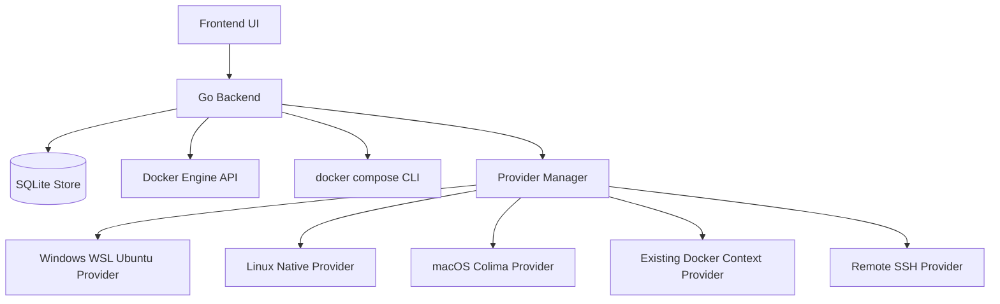
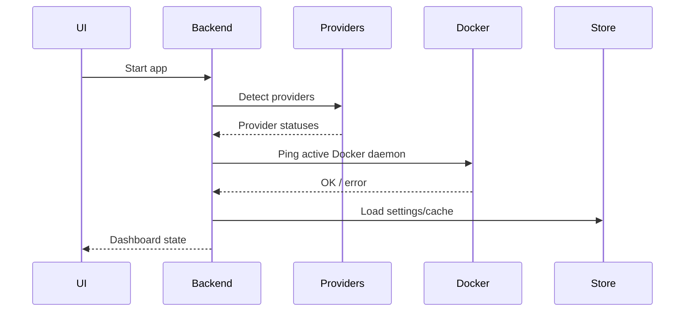
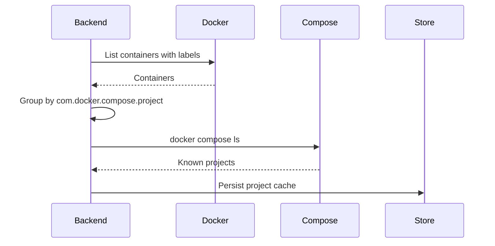
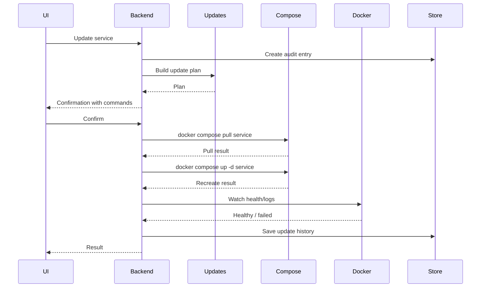

# Cairn Architecture

## 1. Architectural goal

Cairn must behave as one app across Windows, Linux, and macOS, while hiding platform-specific differences behind provider adapters.

The core app should not care whether Docker is running:

```text
- natively on Linux
- inside Ubuntu on WSL2
- inside Colima/Lima on macOS
- on a remote SSH host
- under an existing Docker context
```

The provider layer owns those differences.

---

## 2. System diagram



---

## 3. Core layers

### 3.1 Frontend UI

Responsibilities:

```text
Rendering pages
Showing charts
Showing logs
Showing terminal sessions
Triggering backend actions
Displaying confirmation modals
Showing real command previews
```

The frontend should not execute shell commands directly.

### 3.2 Go backend

Responsibilities:

```text
Docker API communication
Compose CLI execution
Provider installation/detection
Project grouping
Metrics aggregation
Log streaming
Terminal session creation
Image update checks
SQLite persistence
Audit logging
```

### 3.3 Provider manager

Responsibilities:

```text
Detect available providers
Select active provider/context
Start/stop backend services
Map paths
Run platform-specific commands
Return Docker connection details
```

### 3.4 Docker API client

Use for:

```text
Containers
Images
Volumes
Networks
Stats
Logs
Exec
Events
Inspections
```

### 3.5 Compose CLI wrapper

Use for:

```text
up/down/restart/pull
config validation
project lifecycle
service-level operations
project logs where Compose semantics matter
```

---

## 4. Event flow

### App startup



### Project detection



### One-click service update



---

## 5. Module boundaries

```text
internal/providers
  Platform detection, install, start/stop, path mapping.

internal/docker
  Docker API wrapper.

internal/compose
  docker compose CLI wrapper and Compose project discovery.

internal/metrics
  Stats collection, aggregation, retention.

internal/updates
  Registry digest checks, update plans, update execution.

internal/terminal
  Host/backend/container terminal management.

internal/backups
  Volume backup/restore.

internal/security
  Confirmation rules, audit log, permission checks.

internal/store
  SQLite persistence and migrations.
```

---

## 6. Design constraints

```text
Never assume Docker Desktop exists.
Never require Docker Desktop.
Never implement a custom runtime in v1.
Never bypass user confirmation for destructive actions.
Never store secrets unencrypted.
Use Docker API for live state.
Use Compose CLI for Compose lifecycle behavior.
Use provider adapters for OS differences.
```
