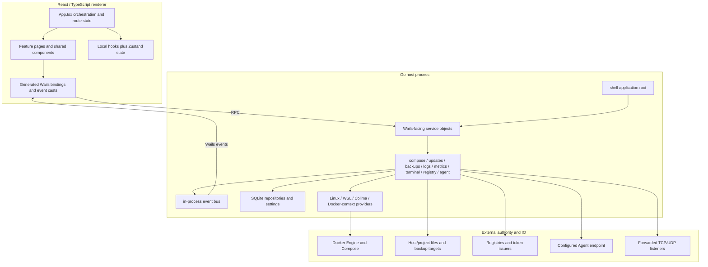
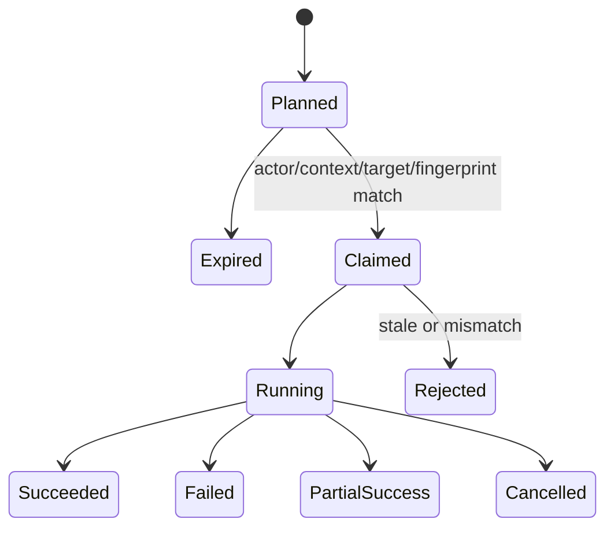

# System Architecture and Cross-Cutting Gaps

- Review date: 2026-07-15
- Scope: whole-system structure and contracts spanning the React renderer, Wails transport, Go services, provider/Docker adapters, background work, event delivery, SQLite, filesystem/network integrations, tests, and delivery pipeline.

## Architectural assessment

Cairn has a recognizable layered design and many useful primitives, but the boundaries do not yet enforce the invariants its feature set needs. The dominant architectural pattern behind the defects is **independent feature evolution without one shared model for identity, operation ownership, resource budgets, event guarantees, persistence atomicity, and transport trust**.

That shows up repeatedly:

- Project, Docker-object, plan, stream, and frontend request identities omit different scope dimensions.
- Services perform mutations and then independently try to update cache/audit/history, producing ambiguous partial success.
- Background work is started from many layers with inconsistent cancellation, admission, expiry, and shutdown behavior.
- Events use one best-effort mechanism for both disposable telemetry and state-critical completion.
- Desktop-only APIs are reused unchanged in server mode even though the trust boundary changes completely.
- The frontend centralizes orchestration and high-frequency state in one 19,431-line `App.tsx`, while backend composition registers a broad service surface from one shell root with little boundary policy.
- Tests prove many local functions but rarely prove cross-layer contracts such as “visible target equals action target,” “every advertised event is forwarded,” “a mutation has one durable final outcome,” or “all work stops under one deadline.”

The `ARCH-*` labels in this document are **cross-cutting themes over the detailed BE/FE/OPS catalog, not additional findings**.

## Current architecture snapshot



### Useful existing foundations

- Domain packages are separated by concern (`backups`, `compose`, `lineage`, `logsvc`, `metrics`, `portforward`, `registry`, `terminal`, `updates`) instead of placing all behavior in the Wails service layer.
- Provider abstractions make Linux native, Windows WSL, macOS Colima, and existing Docker contexts explicit concepts.
- SQLite migrations and repositories centralize much of the durable data model.
- Typed application errors, plan types, audit storage, a bus, a runtime controller, generated bindings, and integration fixtures already exist.
- Strict TypeScript, ESLint, a sizable Vitest suite, Go package tests, release UI tests, and real-Docker/WSL fixtures provide a meaningful verification base.

These are worth preserving. The recommended changes below strengthen contracts around them rather than requiring a full rewrite.

## Cross-cutting architecture gaps

### ARCH-01 — There is no canonical resource identity model

Project IDs omit Docker context/import path; object caches are not provider/context scoped; stale cleanup uses only provider; several services accept IDs outside the active scope; port-forward identity omits bind address. Frontend detail state separately loses request/selection generation. The result is collision, stale cache reuse, cross-context action, and misleading UI.

Primary evidence: BE-005 through BE-007, BE-018, BE-028, FE-001 through FE-003, FE-020, FE-021, FE-029.

Recommended target:

```text
ResourceKey = {
  installationID,
  providerID,
  dockerContextID,
  resourceKind,
  nativeStableID,
  sourcePathOrImportID?,
  generation?
}
```

- Persist and index the complete key.
- Require it at every service boundary; never infer provider/context from mutable global state after request admission.
- Include the same scope in cache, event, stream, job, plan, and frontend query keys.
- Provide a migration that detects/merges existing collisions explicitly rather than silently re-keying them.

### ARCH-02 — User intent is not represented by one operation protocol

Provider installs, updates, backups, file edits, Docker commands, and other destructive actions use different plan stores and different confirmation/expiry/replay rules. Some routes bypass planning. Frontend operations also lack immutable target/session keys.

Primary evidence: BE-013 through BE-016, BE-030, BE-036, BE-043 through BE-046, BE-070 through BE-072, FE-002 through FE-006, FE-019.

Recommended target: a single durable operation state machine:



Every operation should bind actor/session, full resource key, normalized arguments, source fingerprint/generation, risk/confirmation, idempotency key, deadline, and audit identity. Apply must atomically claim once and revalidate immediately before side effects.

### ARCH-03 — External side effects and local state do not have a partial-success contract

Docker/container/Compose/file mutations can succeed before cache, audit, update history, or other persistence fails. Some methods return failure even though the external world changed; others suppress audit/durability errors and return success. Retrying either outcome can duplicate or compound work.

Primary evidence: BE-035, BE-046, BE-058, BE-059, BE-075, BE-078, BE-082.

Recommended target:

- Allocate an operation/outbox record before mutation.
- Use stable idempotency keys and explicit phases.
- After the external side effect, persist a reconciliation-required `PartialSuccess` state if local commit fails.
- Return a structured result containing external outcome, local-state outcome, safe recovery instructions, and whether retry is safe.
- Run startup/background reconciliation for unfinished operations.
- Never translate “audit/cache write failed” into “Docker/file action did not happen.”

### ARCH-04 — Background work lacks root ownership and structured concurrency

Install jobs detach from application lifetime; event bursts launch overlapping reconciliation; polling can be duplicated; update/log/metrics/terminal/backup work has inconsistent caps and shutdown; plan cleanup goroutines and bus cleanup can leak. The shell closes only some plan stores and shutdown has no shared budget.

Primary evidence: BE-012, BE-013, BE-019, BE-023, BE-036, BE-043, BE-046 through BE-050, BE-053, BE-056, BE-069, BE-071, BE-074; FE-004, FE-006, FE-022, FE-023, FE-045.

Recommended target:

- One application root context and task group owns all workers.
- Admission/reservation occurs before child process, stream, or goroutine creation.
- Every worker has identity, owner, deadline, cancellation cause, bounded output, and a final joined state.
- Reconciliation is single-flight/coalesced per scoped resource and generation.
- Shutdown cancels once, stops admission, waits under one global deadline, reports stragglers, and force-cleans only after the budget.
- UI navigation either transfers operation ownership to a global job model or cancels it; component-local state must not be the sole owner of backend work.

### ARCH-05 — Event delivery has no semantics by event class

The in-process bus can silently drop terminal and completion events, while shell forwarding omits three topics the UI expects. Server broadcasting fans out to every client and contains unsynchronized map reads. The frontend often trusts unvalidated payload assertions and teardown can invoke new work.

Primary evidence: BE-004, BE-024, BE-069, BE-073; FE-009, FE-019 through FE-023, FE-056.

Recommended target:

| Event class                     | Required semantics                                                                         |
| ------------------------------- | ------------------------------------------------------------------------------------------ |
| Telemetry samples               | Bounded latest-value/coalescing; drops are measured and communicated.                      |
| Log chunks                      | Bounded ordered sequence with cursor/overflow marker and resumable history.                |
| Progress                        | Generation/job keyed; coalescible intermediate states, durable/queryable final state.      |
| Terminal bytes                  | Bounded per-session ordered flow control; explicit truncation/disconnect.                  |
| Completion/error/security event | Must not be silently dropped; persist/query final operation state and notify exactly once. |
| Multi-user server event         | Actor/tenant/resource authorized subscription; never global broadcast by default.          |

Generate or centrally declare the event catalog so backend publication, shell forwarding, TypeScript type generation, runtime validation, and tests all derive from one definition.

### ARCH-06 — Resource budgets are feature-local or absent

Several paths allocate based on caller/network/file/process input before enforcing limits. Other features cap one dimension but not aggregate concurrency/cardinality. There is no per-client identity in server mode, so quotas cannot be fairly charged.

Primary evidence: BE-002, BE-019 through BE-021, BE-041, BE-048, BE-053, BE-061, BE-064, BE-067, BE-073, BE-074, BE-083; FE-010, FE-044 through FE-051.

Recommended target: a service-boundary budget object propagated through every call:

```text
Budget {
  actor/client ID,
  max request bytes and collection items,
  max response/event bytes,
  memory/disk allowance,
  job/session/child-process slots,
  deadline and cancellation,
  rate-limit class
}
```

Keep feature-specific stricter limits below it. Add metrics for rejected admission, queue time, active slots, dropped/coalesced events, truncation, retained rows/bytes, and shutdown duration.

### ARCH-07 — Persistence models snapshots/history without generation and retention policy

Update checks are written non-atomically and “latest” grouping can select stale rows; Compose reconciliations can commit older snapshots last; metrics range queries combine retention tiers incorrectly; audit/notification/update history has no lifecycle; secret-valued build args are persisted.

Primary evidence: BE-008 through BE-011, BE-043 through BE-046, BE-052, BE-062 through BE-065.

Recommended target:

- Add a generation/run table and write a complete snapshot transactionally.
- Promote a generation only after successful completion; query the promoted generation, not row-wise max timestamps.
- Reject stale reconciliation commits with compare-and-swap generation.
- Define table-by-table ownership, retention, compaction, export, deletion, and secret classification.
- Add migration fixtures from every released schema version plus crash/fault injection around promotions.

### ARCH-08 — Provider abstraction leaks host/backend namespace details

The service/terminal layers use host path separators after backend mapping, silently retain unmapped host paths, expose saved settings that providers do not consume, and use transports whose advertised deadlines do nothing. Private image pull auth and context scoping also vary by path.

Primary evidence: BE-017, BE-049, BE-055, BE-057, BE-068, BE-080; OPS-025, OPS-031.

Recommended target: make providers return a complete immutable execution environment descriptor:

- backend OS/path syntax and path-list separator;
- canonical host<->backend mapping with typed failure;
- Docker endpoint/dialer and real cancellation/deadline behavior;
- credential/config location and supported helper operations;
- shell/sudo/privilege capabilities;
- supported install/update/recovery methods;
- stable provider/context identity and health generation.

Services should not branch on host `runtime.GOOS` after choosing a provider.

### ARCH-09 — Server mode is not a deployment variant; it is a different security product

The current server build reuses desktop composition, service registration, event model, settings/filesystem assumptions, and Docker authority. It also diverges by platform: Windows server compilation fails, Linux headless compiles, and the supplied container lacks the state/authority needed for core work while running as root.

Primary evidence: BE-001, BE-002, BE-073, BE-074, BE-076; OPS-001 through OPS-003.

Recommended target: either remove server mode or create a separate command/package with:

- an allowlisted remote API, not Wails desktop object dispatch;
- mandatory authentication, actor identity, authorization, tenancy, TLS/proxy trust, CSRF/Host/Origin policy;
- server-specific storage, credential, Docker connection, backup, logging, health/readiness, migration, and shutdown design;
- per-client quotas and event isolation;
- an independently tested and released container with non-root/read-only defaults.

### ARCH-10 — Frontend state architecture does not model asynchronous ownership

The 19,431-line root component hosts route orchestration and high-frequency live state. Many effects commit whichever promise resolves, share broad loading/error flags, or retain old data while selection changes. Long-lived xterm instances stay mounted. Settings saves overlap and component remount keys disrupt focus.

Primary evidence: FE-001 through FE-008, FE-014 through FE-024, FE-029, FE-045 through FE-049, FE-067.

Recommended target:

- Split by bounded feature route with feature-owned query/mutation state.
- Use immutable query keys containing full resource scope and generation.
- Centralize long-running backend jobs/streams in an operation store independent of component lifetime.
- Use reducers/state machines for multi-step workflows (provider setup, restore, Agent edit, update).
- Give each inventory slice its own last-known-good data/status/error/generation instead of one global refresh state.
- Isolate high-frequency logs/metrics/terminal state so it cannot rerender unrelated routes.
- Virtualize with measured/variable row height when wrapping is allowed and dispose or suspend hidden terminal renderers.

### ARCH-11 — Runtime contracts are generated at compile time but not validated at runtime

The tree type-checks, yet event/persisted payloads are asserted rather than decoded. The Go Wails module and frontend runtime are on different alpha revisions, and no native protocol-contract smoke protects that boundary. Browser E2E mocks Wails.

Primary evidence: FE-056, FE-061; OPS-024, OPS-034.

Recommended target:

- Pin matching Wails Go/CLI/JS versions through one source of truth.
- Generate both TypeScript types and runtime decoders/schema fixtures from backend DTO/event definitions.
- Fail fast with a typed protocol error and telemetry when payload validation fails.
- Run a minimal packaged/native-webview smoke on each released OS that invokes representative unary, error, streaming/event, cancellation, and large bounded payload contracts.

### ARCH-12 — UI component contracts do not encode accessibility requirements

Shared Tabs does not implement focus/panel semantics; Button does not require an accessible name for icon-only use; modals/palette do not consistently trap/restore focus; DataTable column controls are mouse-only; live statuses are not generally announced. ESLint omits JSX accessibility rules and Axe disables the color-contrast rule that would catch a known failure.

Primary evidence: FE-031 through FE-043, FE-059, FE-062.

Recommended target:

- Make correct ARIA/focus behavior part of shared component APIs and tests.
- Adopt `eslint-plugin-jsx-a11y` plus project rules for icon-only labels and modal ownership.
- Test keyboard-only navigation, focus restoration, reduced motion, high contrast, 200% zoom, and screen-reader announcements on every major workflow.
- Do not suppress Axe rules globally; document narrowly scoped exceptions with expiration.

### ARCH-13 — Build and release evidence is descriptive instead of enforcing state

Release validation scripts accept “blocked” evidence and wording; tag publication is not conditioned on exact-commit CI; package checks are often non-empty-file checks; evidence references older commits/runs; signing and provenance fail open. This makes documentation look like a release state machine without actually being one.

Primary evidence: OPS-004 through OPS-008, OPS-015 through OPS-022, OPS-028, OPS-032, OPS-035, OPS-037.

Recommended target:

- Store machine-readable release criteria with pass/fail/waived states, evidence artifact digests, tested commit SHA, environment, tool versions, and expiration.
- Require all mandatory criteria for the exact tag target before release jobs receive signing/publish permissions.
- Separate build, test, signing, and publish jobs with artifact attestations between them.
- Validate package structure, signatures, installed payload, launch, migration, uninstall, and update path on supported clean systems.

### ARCH-14 — Repository/module boundaries and code concentration reduce isolation

The Go module includes a Go package nested under `frontend/node_modules`; production build steps can resolve/mutate dependencies; `App.tsx` is 19k lines and its test is 4.8k lines; Agent/Settings/Terminal pages are also large. One main frontend chunk is ~1.27 MiB minified.

Primary evidence: FE-047, FE-051; OPS-013, OPS-014, OPS-025.

Recommended target:

- Move frontend installation outside the Go module discovery tree or add a nested `frontend/go.mod` boundary and enforce expected `go list` output.
- Use lockfile-frozen installs and build-only commands in production.
- Split App orchestration by feature boundaries and lazy-load heavy routes/libraries such as Monaco, charts, and terminals.
- Set maintainability/bundle budgets and enforce them incrementally rather than relying on one large rewrite.

## Target contract matrix

| Concern         | Current implicit behavior                              | Required explicit contract                                                                  |
| --------------- | ------------------------------------------------------ | ------------------------------------------------------------------------------------------- |
| Identity        | IDs often assume one active provider/context.          | Full scoped resource key carried through DB, cache, RPC, event, plan, stream, and UI state. |
| Mutation        | Side effect plus best-effort local writes.             | Durable operation state, idempotency, partial-success outcome, reconciliation.              |
| Async UI        | Promise completion may mutate current selection state. | Query/mutation generation and immutable target equality before commit/action.               |
| Events          | Shared best-effort bus/forwarding.                     | Per-class delivery, ordering, loss, backpressure, replay, and final-state guarantees.       |
| Background work | Feature-created goroutines/processes.                  | Root-owned task group, admission before spawn, cancellation, join, one shutdown deadline.   |
| Resources       | Ad hoc/no caps.                                        | Request/client/feature/global budgets with telemetry and consistent errors.                 |
| Persistence     | Row-level timestamps and open-ended history.           | Transactional generations, retention/data classification, migration/fault tests.            |
| Provider paths  | Host assumptions leak after backend selection.         | Provider-owned namespace/environment descriptor; mapping fails closed.                      |
| Desktop/server  | Same service surface, different transport.             | Separate trusted desktop bridge and authenticated allowlisted server API.                   |
| Runtime types   | Compile-time generated types plus casts.               | Version-locked protocol plus runtime decoding and native contract smoke.                    |
| Release         | Human evidence text and tag-triggered jobs.            | Exact-SHA policy gate, isolated signing, immutable attested artifacts.                      |

## Recommended architecture decision records

Create and approve ADRs before implementing the roadmap so each feature does not reinvent policy:

1. Resource identity and migration across provider/context/import scopes.
2. Unified operation/plan/idempotency/partial-success state machine.
3. Event classes, schemas, runtime validation, backpressure, replay, and multi-client isolation.
4. Structured concurrency, job/session admission, and shutdown deadline.
5. Service resource-budget API and default limits.
6. Data classification, secret handling, retention, and safe renderer/Agent DTOs.
7. Provider execution-environment/path/credential capability model.
8. Desktop-only versus server-safe API decision.
9. Release evidence, signing isolation, provenance, and artifact immutability.
10. Frontend feature boundaries, async query ownership, and accessibility component contracts.

## Architecture acceptance tests

- Two providers and two Docker contexts with colliding names/IDs cannot share cache, DB state, events, plans, or UI detail.
- Reordered, rejected, cancelled, and late frontend responses never become visible/actionable under another target.
- Every destructive method is discovered by a reflection/manifest test and must use the unified operation policy.
- Fault injection after each external side effect yields one durable `Succeeded`, `Failed`, or `PartialSuccess` result with safe retry semantics.
- Every event declared for the frontend is forwarded and runtime-validated; final events are queryable even when delivery is interrupted.
- Mixed adversarial calls keep memory, goroutines, processes, connections, sessions, queue latency, and disk growth under configured limits.
- All background work terminates under one tested shutdown budget, including blocked readers/processes and provider rebind.
- Database snapshot generations remain monotonic under overlapping reconciliation and crash injection; retention is deterministic.
- Native packaged apps exercise the real Wails protocol on every supported OS; server tests, if retained, prove two-user isolation and authorization.
- Release artifacts trace to an exact tested SHA, have verified inner signatures where applicable, signed provenance/SBOM/checksums, and cannot be silently replaced.

## Detailed reports

- [Backend, data correctness, concurrency, and security](./02-backend-data-correctness-concurrency.md)
- [Security, privacy, and data integrity](./03-security-privacy-and-data-integrity.md)
- [Frontend correctness, UX, accessibility, performance, and tests](./04-frontend-correctness-ux-accessibility-performance.md)
- [Build, test, CI, release, packaging, documentation, and operations](./05-build-test-ci-release-documentation.md)
- [Validation evidence, review method, and limitations](./07-validation-and-review-method.md)
