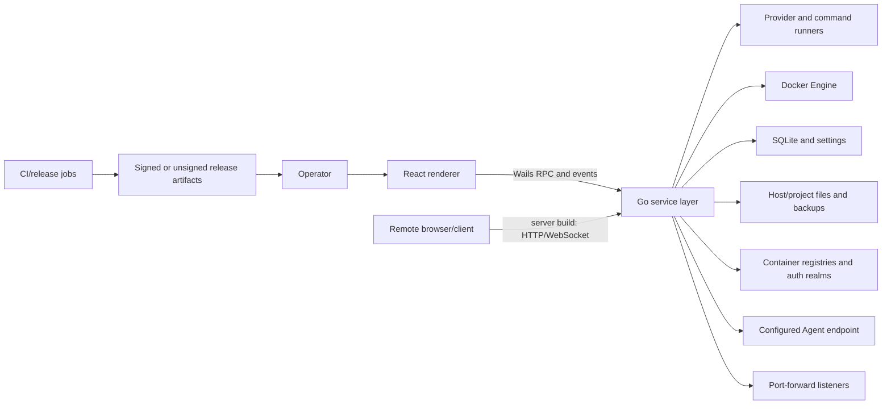

# Security, Privacy, and Data-Integrity Review

- Review date: 2026-07-15
- Scope: Cairn's desktop and advertised server/container modes; renderer/backend boundary; Docker and provider authority; registry credentials; Agent data flow and file edits; backups; port forwarding; persistence; release supply chain; local IPC; and user-facing security claims.

## Bottom line

Cairn should be treated as a **high-authority local operations tool**, not as an ordinary informational desktop app. It can reach Docker, start terminals and provider commands, read project/configuration data, modify files, move registry credentials, create backups, publish ports, and apply updates. That authority makes the following four distinct issues release-critical:

1. The advertised server build turns the full desktop service surface into an unauthenticated, cross-origin-capable remote API. This is the dominant stop-ship issue for any server artifact or deployment.
2. A registry can direct stored credentials to an attacker-selected HTTPS Bearer-token realm.
3. Frontend stale-response bugs can make destructive actions operate on a different project/Agent target than the one the operator sees.
4. Several confirmation policies are bypassable or inconsistent for imported Compose deployment, local-driver bind volumes, image runs, provider stop/install plans, and stale update plans.

The desktop-only threat posture is materially better than server mode because Wails' local renderer is normally the caller. It is still not a complete security boundary: renderer compromise, unsafe navigation, malicious project content, a hostile registry/Agent endpoint, another local user/process, and ordinary operation races can reach privileged code paths. Defense in depth is therefore required even if server mode is removed.

The `SEC-*` labels below are **security lenses over the primary BE/FE/OPS catalog, not additional finding counts**. The authoritative detailed findings and exact line evidence are in the linked reports.

## Trust and asset model

### Assets requiring explicit protection

| Asset                 | Why it matters                                                                                                                                         | Current exposure paths                                                                                                     |
| --------------------- | ------------------------------------------------------------------------------------------------------------------------------------------------------ | -------------------------------------------------------------------------------------------------------------------------- |
| Docker authority      | Docker socket access is commonly host-equivalent through privileged containers, bind mounts, image creation, or filesystem access.                     | Wails services, provider transports, Windows named-pipe bridge, server container mounts, terminal and Compose/update APIs. |
| Host/project files    | Compose files, `.env`, source, Docker archives, exported logs, and Agent edits can contain secrets or control deployment behavior.                     | Import review, Agent context/editing, image load/save, log export, backups, arbitrary paths accepted by renderer services. |
| Registry credentials  | Passwords, identity tokens, and helper-backed credentials grant image read/write access.                                                               | Login stdin, Docker config mutation, challenge-driven token requests, raw provider errors.                                 |
| Operational telemetry | Logs, inspect output, metrics, notifications, audit records, terminal output, and Agent prompts can contain sensitive business or infrastructure data. | Renderer/event transport, SQLite, exports, Agent endpoints, diagnostics, server WebSockets.                                |
| Release identity      | Signing keys, published binaries, checksums, update links, and release tags establish what users trust and run.                                        | CI secrets, mutable GitHub release assets, fail-open signing, dependency/build actions.                                    |
| User intent           | Confirmation plans and the selected UI target are the authorization signal for destructive actions.                                                    | Stale frontend state, replayable/stale plans, inconsistent planning policy, cross-provider/context identifiers.            |

### Trust zones and boundaries

The critical architectural mistake is that `EXT -> S` currently receives essentially the same service authority as `R -> S`, without a new authentication, authorization, tenancy, origin, or resource-control boundary.

## Consolidated security risk register

| Lens                                          | Severity                | Security conclusion                                                                                                                                                                                                                                                         | Primary finding references                                                                    |
| --------------------------------------------- | ----------------------- | --------------------------------------------------------------------------------------------------------------------------------------------------------------------------------------------------------------------------------------------------------------------------- | --------------------------------------------------------------------------------------------- |
| SEC-01 Server remote-control boundary         | **Critical**            | Server mode binds the privileged desktop API to HTTP, publishes all interfaces in the supplied task, has no Cairn authentication/authorization/TLS/CSRF/Host/Origin policy, and accepts any WebSocket origin. Ordinary runtime bodies and event fan-out are also unbounded. | BE-001, BE-002, BE-073, BE-074, BE-076; OPS-001, OPS-003                                      |
| SEC-02 Registry challenge trust binding       | **Critical**            | Cairn forwards Basic credentials or an identity token to any HTTPS Bearer realm named by a challenged registry. HTTPS authenticates that realm's certificate; it does not prove that the realm is authorized to receive credentials for the original registry.              | BE-003                                                                                        |
| SEC-03 Visible target versus action target    | **Critical**            | Project-detail and Agent async results can cross selection boundaries and remain actionable. This breaks the operator's core authorization invariant: “the action applies to what I currently see.”                                                                         | FE-001, FE-002, FE-003, FE-004, FE-005, FE-006                                                |
| SEC-04 Operation-plan consistency             | **High**                | Planning/confirmation is fragmented across independent stores and APIs. Import auto-deploy, local volume bind options, some image runs, Provider Stop, concurrent/replayed install plans, and stale update plans bypass or weaken policy.                                   | BE-013 through BE-016, BE-045, BE-070 through BE-072                                          |
| SEC-05 Project/provider/context identity      | **High**                | IDs and caches omit the provider/context/import dimensions needed to prevent collision and cross-context mutation. Several services accept a project ID without checking the active scope.                                                                                  | BE-005 through BE-007, BE-018; FE-001                                                         |
| SEC-06 Agent endpoint and disclosure          | **High**                | Arbitrary endpoints, private/link-local destinations, DNS changes, and cross-origin redirects can receive project, Docker, log, and inspect context. Documentation calls the feature local even though remote endpoints are supported.                                      | BE-037, BE-039; OPS-040                                                                       |
| SEC-07 Agent redaction and file boundary      | **High**                | Line-pattern redaction misses multiline/opaque secrets and line-count limits do not impose byte/token limits. Reads can be unbounded/special files; writes are non-atomic and raceable; audit failures can disappear.                                                       | BE-038 through BE-040, BE-082                                                                 |
| SEC-08 Raw project and host-file APIs         | **High**                | Import review can return raw/interpolated Compose and env data, including external paths; image/log APIs accept arbitrary paths; a compromised renderer or server caller can read/overwrite with process authority.                                                         | BE-060, BE-063                                                                                |
| SEC-09 Registry credential storage/integrity  | **High**                | Private pulls ignore configured credentials, body sizes are unbounded, helper setup may fail open to inline credentials, login mutates whitespace-bearing secrets, and Docker config read/modify/write can lose concurrent credential/config changes or corrupt the file.   | BE-017, BE-041, BE-042, BE-077, BE-078                                                        |
| SEC-10 Network exposure through forwarding    | **High**                | WSL port forwarding can bind to LAN by default, IPv6 semantics are widened or silently omitted, identity omits bind address, failed UDP sessions are cached, and listener/session resources lack explicit limits.                                                           | BE-025 through BE-029; FE-018                                                                 |
| SEC-11 Backup trust and restore integrity     | **High**                | A mutable helper image receives excessive privilege; live-volume backups are called safe; metadata fidelity is undefined; cancellation may leave daemon work; failed restore leaves partial volumes; filename allocation and sidecar durability are unsafe.                 | BE-030 through BE-036, BE-075                                                                 |
| SEC-12 Request/resource exhaustion            | **High in server mode** | HTTP bodies, registry JSON, file reads, provider output, log records/history, streams, jobs, registry-host maps, event clients/fan-out, and several durable tables lack coherent quotas/retention.                                                                          | BE-002, BE-019 through BE-021, BE-041, BE-048, BE-053, BE-064, BE-067, BE-073, BE-074, BE-083 |
| SEC-13 Local transport and privilege metadata | **High/Medium**         | The Windows Docker bridge lacks explicit least-privilege ACL/quotas; bridge failure is hidden; stdio deadlines are no-ops; terminal root status can be falsely reported as non-root; mapping errors fail open.                                                              | BE-049, BE-066, BE-068, BE-079, BE-080                                                        |
| SEC-14 External mutation and audit ordering   | **High**                | Docker/file operations can succeed while Cairn reports failure, or succeed without a durable audit record. The system lacks a uniform partial-success/idempotency/outbox contract.                                                                                          | BE-059, BE-082; OPS-027                                                                       |
| SEC-15 Secret-adjacent persistence            | **High**                | Resolved build-argument values are persisted as metadata; raw Compose/env data reaches the renderer; audit/update/notification history lacks retention; provider output and diagnostic commands can expose secrets.                                                         | BE-062 through BE-064, BE-067; FE-053                                                         |
| SEC-16 Renderer/web hardening                 | **Medium/High**         | Runtime Wails/event payloads are asserted rather than validated, no explicit CSP/navigation policy is visible in the document, external update URLs are not constrained in the frontend, and E2E does not validate the native webview boundary.                             | FE-054, FE-056, FE-057, FE-061                                                                |
| SEC-17 Release signing and provenance         | **High**                | A tag can publish without exact-commit CI gates; signing secrets are job-wide; only the outer Windows installer is signed; production signing fails open; assets are mutable; SBOM/checksums lack signed provenance.                                                        | OPS-004 through OPS-008, OPS-032, OPS-035, OPS-036                                            |
| SEC-18 Dependency/build supply chain          | **High**                | The pinned build toolchain misses a Go security patch, vulnerability waivers are broad/unexpired, Docker contexts can include local secrets, actions/images/downloads are mutable, and production builds may resolve or rewrite dependencies.                               | OPS-009 through OPS-013, OPS-033, OPS-034                                                     |
| SEC-19 Container and CI daemon authority      | **High**                | The server container is functionally incomplete, ephemeral, and root; Docker integration shares a world-writable daemon socket with a broad lint job; image/context boundaries are not minimized.                                                                           | OPS-003, OPS-011, OPS-023; BE-076                                                             |
| SEC-20 Security claims and governance         | **Medium/High**         | “Local” Agent and redaction claims omit material limits; release-ready language conflicts with open blockers; no SECURITY.md or disclosure process exists; support/recovery boundaries are underspecified.                                                                  | OPS-015, OPS-016, OPS-030, OPS-031, OPS-038 through OPS-040                                   |

## Detailed attack and failure scenarios

### 1. Remote server compromise

An operator follows the supplied server/container task, which publishes port 8080 without a loopback host. A network client or browser-origin request reaches Wails runtime dispatch. There is no Cairn login or method authorization, and the WebSocket origin check is disabled in the pinned Wails server. The caller can invoke registered provider, Docker, terminal, file, backup, registry, settings, Agent, and port-forward services. If the container has the Docker socket or useful host mounts, the effective impact is host compromise. Running as root increases the blast radius. This chain is source-confirmed; it does not depend on a hypothetical memory-corruption exploit.

Required containment: remove server artifacts from production until a separately designed server-safe API exists. Binding to loopback is a useful emergency reduction, but not a complete fix because cross-origin browser requests and local adversaries remain.

### 2. Registry credential relay

Cairn contacts a configured registry with stored credentials available. The registry replies with a Bearer challenge whose `realm` names an attacker-controlled HTTPS origin. Cairn constructs a token request to that realm and includes Basic credentials or an identity token. Scheme validation prevents plain HTTP but there is no same-origin/trusted-realm binding. The credential is disclosed before manifest verification.

Required containment: accept credentials only for the registry origin or a registry-specific, explicitly trusted issuer relationship. Never infer credential authorization solely from a challenge received over HTTPS.

### 3. Wrong-project destructive action

The operator selects project A and starts a detail/Agent request, then selects B. A's slower response commits into the current UI state. The header/selector can indicate B while the actionable object/plan still contains A's ID/path. The operator approves an update, build, Compose action, or Agent edit believing it applies to B. This is a direct integrity failure even with a fully trusted user and backend.

Required containment: every async operation must carry an immutable `{scope, target, generation}` key; the reducer must reject obsolete completions; destructive controls must be disabled unless visible and actionable identities are equal.

### 4. Project-supplied data exfiltration through Agent

A project contains `.env`, a multiline private key, opaque tokens under innocuous names, large single-line content, or a symlink/special file. The Agent context collector reads and line-redacts content, then sends it to a configured endpoint. Multiline secret bodies and opaque values can survive; JSON escaping can turn a large file into one logical line and bypass the context-line limit. Cross-origin redirects may send the POST body elsewhere.

Required containment: default-deny file/value collection, structured field allowlists, regular-file and containment checks, byte/token budgets, secret-format detection, an exact outbound preview, loopback default, and final-origin enforcement.

### 5. Shared Docker config corruption/lost update

Cairn reads the user's complete Docker `config.json`, modifies helper/auth keys, and writes the complete final file. Another Docker process updates the file after Cairn's read, or Cairn is interrupted while directly truncating it. The other update is lost or the file becomes invalid, potentially breaking registry access outside Cairn.

Required containment: atomic same-directory replace, conflict detection/locking, metadata preservation, and use of supported Docker credential-helper operations rather than broad shared-file rewriting.

### 6. Release substitution or unsigned trust gap

A version tag triggers a release job that is not required to prove the exact commit passed normal CI/release validation. Job-wide signing credentials are present while dependencies and build tooling run. When signing configuration is missing, public production artifacts can still be published; release assets can later be replaced. Checksums and SBOMs do not establish signed build provenance.

Required containment: protected/tag-provenance release orchestration, exact-SHA required checks, isolated least-privilege signing jobs, fail-closed stable release policy, immutable artifacts, signed attestations/provenance, and verification of installed payloads.

## Privacy and sensitive-data flow

| Data class                        | Collection/use                                | Persistence or egress                                                                         | Required policy                                                                                                        |
| --------------------------------- | --------------------------------------------- | --------------------------------------------------------------------------------------------- | ---------------------------------------------------------------------------------------------------------------------- |
| Container logs and inspect output | Logs UI, diagnostics, Agent tools             | Renderer events, exports, Agent endpoint, possibly audit/error details                        | Per-source caps, explicit export destination, redaction boundaries, documented retention, no silent remote egress.     |
| Compose and environment content   | Import review, project detail, Agent analysis | Renderer DTOs, Agent prompt, possible SQLite metadata                                         | Do not return resolved secret values by default; enforce project containment; explicit reveal/send consent.            |
| Build arguments                   | Lineage and update planning                   | SQLite lineage/update metadata                                                                | Persist names and safe fingerprints only; scrub existing raw values.                                                   |
| Registry credentials              | Docker login and digest resolution            | Docker config/helper; token realm HTTP request                                                | Opaque byte preservation, helper-first storage, origin-bound transmission, no logs/audits.                             |
| Agent prompts/transcripts/context | User assistance and tool calls                | Configured endpoint and frontend memory; documentation is ambiguous about remote destinations | Clear endpoint identity, outbound preview, user-controlled history/retention, remote disclosure consent.               |
| Audit/notification/update history | Security/operations history                   | SQLite without complete retention policy                                                      | Document purpose and retention; cap by time/count; expose cleanup/export; maintain completeness/partial-success state. |
| Backup archives and sidecars      | Volume recovery                               | User-selected filesystem, potentially broad host mounts                                       | 0600/0700 defaults, immutable helper digest, integrity/fidelity verification, cleanup/recovery policy.                 |

No formal privacy notice, data-flow inventory, retention schedule, or threat model was found in the reviewed repository. If Cairn remains strictly local and single-user, that should be stated precisely. If server/multi-user or remote Agent use is supported, actor identity, tenancy, event isolation, access logs, deletion, and retention become mandatory product requirements rather than optional hardening.

## Required security architecture changes

### Separate desktop and server products

Do not expose the desktop service registry over a network transport. Define a server allowlist from first principles. Exclude arbitrary terminal, file, provider-install, Docker-socket, credential, backup-path, and host-integration methods unless there is a strong authenticated use case. Add authenticated actor identity to every request and event, object-level authorization, tenant-scoped storage/cache keys, TLS/proxy trust configuration, Host/Origin/CSRF controls, rate/concurrency/size quotas, and security audit identity.

### Make user intent a verifiable capability

Replace independent plan-store semantics with one operation framework. A plan should bind:

- actor/session;
- provider and Docker context;
- immutable target identifiers and visible names;
- operation kind and normalized arguments;
- source-state fingerprint/generation;
- risk classification and required confirmation;
- creation/expiry/claim/apply/final state;
- single-use idempotency key;
- durable audit/outbox identity.

Application must atomically claim the plan, revalidate all bound state, execute once, and record success, failure, cancellation, or partial success. No service should decide independently that it can skip this contract.

### Establish a resource budget at the service boundary

Every public method needs request cardinality/byte limits before allocation, operation-specific semaphores, per-client and global session caps, bounded queues, cancellation, deadlines that actually reach subprocess/network IO, retention/disk limits, and consistent resource-exhausted responses. Event delivery needs bounded per-client buffers plus an explicit critical-event strategy; terminal completion cannot share best-effort semantics with telemetry.

### Introduce data classification and safe DTOs

Mark fields as public operational metadata, secret, sensitive content, path/capability, or audit-safe. Create purpose-specific renderer and Agent DTOs that omit or redact at the source. Do not rely on a final regex pass. Store only what is needed, encrypt/protect credentials through platform stores/helpers, and add retention/migration scrubbing for historical secret-bearing columns.

### Harden local boundaries

- Set and test explicit named-pipe ACLs for the intended interactive user/service identity; cap connections.
- Enforce a CSP and native navigation/new-window allowlist; validate external URLs in the backend immediately before opening.
- Replace raw caller paths with OS-dialog grants or approved-root capabilities.
- Report privilege state as root/non-root/unknown and fail closed on provider path mapping.
- Initialize protected structured logging, bound diagnostic output, and surface degraded audit/logging state.

## Security verification gate

Before a production release, require all of the following:

1. Server artifact removed/disabled, or independent adversarial review of authenticated server-safe APIs with cross-origin, two-user isolation, body/fan-out, rate, and authorization tests.
2. Registry challenge tests proving credentials never cross an unapproved origin, including redirects, DNS rebinding, HTTPS downgrade, identity tokens, and Basic auth.
3. Deferred-response frontend tests proving every destructive target remains equal to the visible target across navigation, rejection, cancellation, and reordered completion.
4. A plan conformance suite covering replay, concurrent apply, expiry, stale state, actor/context mismatch, all destructive method families, and partial success.
5. Agent privacy fixtures for multiline PEM, opaque tokens, env formats, Unicode, huge one-line files, special files, symlinks, redirect chains, and exact outbound byte/token limits.
6. Resource-adversarial tests for bodies, registry hosts, streams, logs, subprocess output, event clients, files, durable tables, and shutdown under a single deadline.
7. Atomicity/fault-injection tests for Docker config, Agent edits, backup archive/sidecar publication, restores, update history, and audit outbox behavior.
8. Native-webview CSP/navigation tests and explicit URL/path capability tests.
9. Release from an exact CI-approved SHA with isolated signing, signed installed payloads, immutable checksums/SBOM/provenance, and fail-closed stable publication.
10. SECURITY.md, supported-version policy, disclosure contact, data/retention documentation, recovery runbook, and precise desktop/server/Agent trust assumptions.

## Positive controls worth retaining

- Registry login passes secrets through stdin rather than command-line arguments.
- Remote plain HTTP registry access is restricted, and local exceptions are explicit; BE-003 requires issuer trust binding, not weakening TLS.
- The Wails chunked transport has explicit chunk/aggregate caps; its bounded design can be reused for ordinary requests.
- Agent HTTP responses have a 4 MiB cap, although overflow should be detected explicitly and outbound requests still need budgets.
- Confirmation plans, audit repositories, typed application errors, provider abstractions, and runtime controllers already exist. The main work is to unify and complete their semantics.
- Existing security and integration tests cover several destructive-operation and registry flows; they provide a base for the adversarial matrix above.

## Primary detailed reports

- [Backend, data correctness, concurrency, and security](./02-backend-data-correctness-concurrency.md)
- [Frontend correctness, UX, accessibility, performance, and tests](./04-frontend-correctness-ux-accessibility-performance.md)
- [Build, test, CI, release, packaging, documentation, and operations](./05-build-test-ci-release-documentation.md)
- [Validation evidence, review method, and limitations](./07-validation-and-review-method.md)
