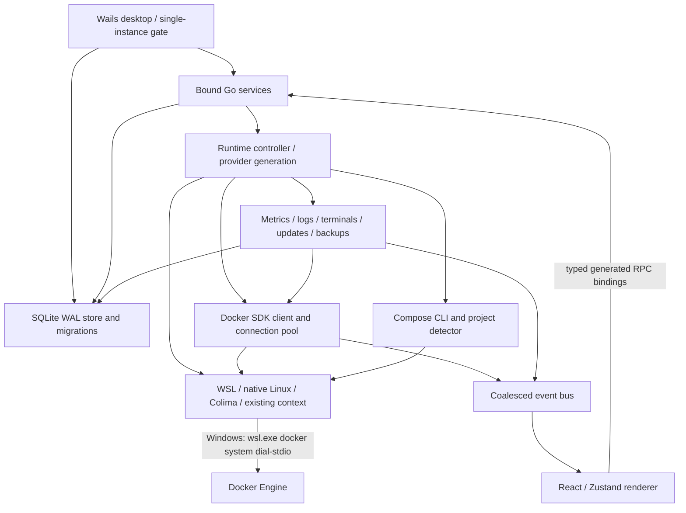

# Cairn project analysis and remediation — 2026-09-20

## Result and scope

This review found and corrected several independent sources of startup and background work amplification. The strongest explanation for the reported WSL symptoms is a combination of concurrent Docker initialization, repeated backend probes, foreground-rate background metrics, and automatic all-container log subscriptions. Long-lived WSL relay processes are also an intentional part of the architecture; their age is not sufficient evidence of a hang.

The review covered architecture, runtime ownership, startup/autostart, providers, Docker transport, metrics, forwarding, frontend state and streams, persistence, dependency maintenance, and build/test integration. Security-sensitive workflows were inspected alongside the existing regression suites. It does not claim exhaustive examination of every execution path or a measured Windows login speedup.

The working tree already contained a large, uncommitted move of application code into `src/`, updated build orchestration, and earlier reliability fixes. Those changes were preserved. This report describes the additional review and changes made on top of that tree; comparing only against Git HEAD would incorrectly attribute the source migration to this review.

Dependency versions, compatibility decisions, and upstream references are recorded in [Dependency refresh](dependency-refresh-2026-09-20.md).

## Architecture

The Go module has a sensible domain split: `providers` abstracts platform behavior; `docker` handles Docker API transport; `compose`, `updates`, `backups`, `registry`, `lineage`, `terminal`, and `logsvc` own workflows; `store` owns persistence; `services` exposes typed RPC; and `shell` owns Wails and runtime assembly. Runtime scopes identify a provider and backend context and are propagated into caches, history, and command plans.

The frontend has useful dedicated stores for app bootstrap and inventory, request deadlines, event coalescing, generated DTOs, and a reusable component set. Its largest maintainability problem is `src/frontend/src/App.tsx`: approximately 24,000 lines and 748 KB of source, with many pages and unrelated effects in one module. That makes startup imports and stream ownership harder to reason about. The targeted terminal split reduces one concrete cost; splitting the remaining pages is a separate architectural improvement.

## Startup and WSL findings

| Priority | Finding | Trigger and impact | Correction |
| --- | --- | --- | --- |
| High | Concurrent lazy Docker initialization | Health, event, metrics, and renderer requests arrive together. Multiple callers that observe no client can create and replace clients in sequence, churn stdio processes, and interrupt work using a replaced client. | Concurrent callers share one initialization result, including failures; explicit reconnect behavior remains separate. |
| High | Overlapping full provider detection | Concurrent Detect/DetectAll calls repeat the same multi-command probe. A slow old probe can finish after distro/profile settings change. | Share in-flight detection per settings snapshot, independently cancel callers, cancel abandoned work, and reject results for superseded settings. |
| High | Background metrics use the foreground interval | The shell passed the configured sample interval as both visible and background cadence. At defaults, hidden sessions still collected every two seconds. | Background sampling is at least ten seconds; visible sampling keeps the user's configured interval. |
| High | Metrics persistence buffer repeatedly sorts and allocates | Each single sample re-sorts the pending batch; at the 10,000-record limit, each append allocates/copies an entire replacement buffer. This is particularly expensive during persistence retries. | Stable insertion for individual samples, stable sorting for retry batch merges, and in-place bounded trimming. |
| High | Hidden renderer retains live metrics and overview logs | The root metrics subscription keeps all containers in the visible set; the overview automatically follows logs for every container. Hidden windows continue consuming streams and updating state. | UI metrics and the overview log preview pause on hide and resume on show. Late stream openings are closed and stale events are ignored. Explicit terminal/log sessions retain their existing semantics. |
| High | Hidden initial load and invalidations still query Docker | Inventory, Compose project refreshes, dashboard reads, reconnects, and resource-change events trigger reads for a window the user cannot see. | Initial UI reads wait for visibility; hidden invalidations are retained and merged, then refreshed when visible. Provider changes still clear data from the old scope immediately. |
| Medium | Repeated WSL IP resolution | Concurrent forward connections miss the same cache and each launch a WSL probe. Reapplying an unchanged distro also invalidates the cache. | Coalesced, cancellable lookup and distro-aware cache reuse; unchanged settings preserve valid cache entries. |
| Medium | Port-forward dialing lacks an explicit connection deadline | A backend that never completes IP discovery or TCP connection establishment can retain a pending connection. | A ten-second budget bounds discovery plus dial. Established connections keep their normal streaming lifetime. |
| Medium | Concurrent GPU refresh and unnecessary process inspection | Subscribers can duplicate an expired GPU probe; attribution walks container process lists even when direct container IDs already resolve ownership. Slow attribution extends request latency. | Shared GPU refresh, bounded probe/attribution budget, and process inspection only for unresolved ownership. |
| Medium | Idle relay expiry competes with the health heartbeat | A ten-second idle timeout matches the ten-second health cadence, making process reuse timing-dependent. | Thirty-second process-backed idle timeout keeps the small idle pool reusable across heartbeats. |
| Medium | Single-instance detection occurs after database startup | A duplicate manual/autostart process opens the database, scans privacy columns, and checkpoints WAL before learning that another instance owns the app. | Wails acquires its instance lock before opening SQLite; services are registered before `App.Run`. |
| Medium | Duplicate privacy scans/checkpoints on ordinary boot | A current database is scrubbed both before and after an empty migration list. This repeats full-table scans and WAL checkpoint work. | Current databases are scrubbed once. New/upgraded databases still receive post-migration cleanup, and legacy data is still scrubbed before migration backup. |
| Medium | Docker CLI bridge startup/shutdown race | Stop can overlap listener creation or acceptance, allowing work to appear after the cleanup snapshot. | Serialize start/stop, reject late accepts, close late dial results, and join workers. |
| Medium | Runtime cleanup depends on Wails reaching its shutdown callback | Failure during application startup can return without running the normal callback. | One idempotent cleanup function is used both by the hook and by deferred cleanup. |
| Medium | Eager terminal dependency | The terminal renderer and command palette shared an import path, bringing xterm into startup even when no terminal was used. | Load the terminal renderer lazily; preserve the existing bounded early-output buffer. |

These changes reduce duplicate work and improve cancellation without changing Docker workloads, recreating containers, changing autostart registration, or resetting WSL.

### What the live process observation establishes

A read-only process snapshot of the pre-update Cairn instance found four direct `wsl.exe` children running Docker stdio relays, each with a WSL wrapper child: eight visible `wsl.exe` processes for four relay connections. The oldest observed relay pair had existed for more than an hour. This was one snapshot, not a leak-growth measurement or a cold-boot trace.

An HTTP connection pool, active logs, terminals, and external clients of the private Docker pipe can legitimately keep relays alive. Cairn disables the streaming Docker event subscription for process-backed transports such as WSL and reconciles periodically instead. It already has bounded stdio close attempts and sanitized transport diagnostics. The corrected idle timeout intentionally retains a small reusable pool longer; a lower process count at every instant is not the acceptance criterion. Stable ownership, fewer repeated launches, and prompt release after work ends are better indicators.

### Quantified regression expectations

- At the default setting, changing background cadence from two to ten seconds reduces scheduled background sampling opportunities by 80%. This is not a claim of an 80% reduction in total CPU or WSL process count.
- A concurrent startup regression exercises 24 callers against one SDK initialization, including a shared failure result.
- Concurrent forwarding lookup tests exercise one backend IP probe for 24 callers.
- Concurrent GPU tests exercise one probe for 16 subscribers and bound slow attribution.
- Visibility tests require zero new UI streams while initially hidden, explicit cleanup on hide, retention of last-good data, and one resumed refresh for merged hidden invalidations.
- The production dependency graph defers 339.86 KB of xterm JavaScript and 3.93 KB of terminal CSS until a terminal surface is actually rendered. This measures emitted asset size, not a claimed startup-time improvement.

Local Go microbenchmarks for the metrics buffer, using the same fixture before and after:

| Operation | Before | After | Allocation change |
| --- | --- | --- | --- |
| Ordered append to a 500-record batch | 2,191 ns/op | 20.08 ns/op | 296 B / 3 allocations → 0 B / 0 allocations |
| Append at the 10,000-record cap | 428,659 ns/op | 27,593 ns/op | 2,163,004 B / 4 allocations → 0 B / 0 allocations |

These correspond to approximately 109× and 15.5× improvements in the isolated append operation. They do not represent whole-application speedups. Stable equal-timestamp ordering, out-of-order samples, and bounded retry retention remain covered by regression tests.

## Domain review

| Area | Assessment and evidence |
| --- | --- |
| Runtime/provider ownership | Frozen provider generations, scoped clients, service rebinding, and invalidated command plans are strong foundations. Concurrent initialization and probe sharing needed the corrections above. Runtime replacement still warrants platform integration tests because RPCs, jobs, streams, and external CLI connections have different lifetimes. |
| Docker API and CLI | API negotiation, custom stdio transport, HTTP/1 handling for hijacked exec, bounded unary requests, object caches, event batching, and cancellation tracking are present. Connection sharing and idle reuse were the main transport gaps identified here. |
| Compose/projects | Reconciliation is scoped; config enrichment has admission and total-time budgets; WSL config concurrency is deliberately one. CLI startup and config reads still cost more than cached inventory. Avoid increasing concurrency as a blanket performance fix. |
| Metrics | WSL uses bounded one-shot stats rather than one permanent stats connection per container. Retention/downsampling and a seeded 100-container/500-image/200-volume test exist. Foreground demand, GPU probe sharing, and background cadence required fixes. |
| Logs/terminal | Bounded stream capacity, output buffers, early-output capture, late-open cleanup, and runtime cancellation are implemented. A passive overview preview nevertheless created active all-container subscriptions; ownership is now visibility-aware. User-opened sessions intentionally remain long-lived. |
| Updates/backups | Plans bind runtime identity and project configuration, use generation checks and project-operation admission, and preserve audit/confirmation paths. Backup code has stable-file identity checks, bounded artifacts, reservations, and cleanup. Existing unit/adversarial tests were rerun; destructive live workflows were not exercised on user data. |
| Registry | Credential helpers, stdin secret handling, auth-origin restrictions, redirect validation, request limits, cache boundaries, and circuit/rate limiting are present. Updated dependencies passed the available vulnerability scans. This is not a penetration-test certification. |
| Local agent | Literal-loopback endpoint validation, explicit ports, proxy/redirect restrictions, bounded JSON, quarantined file editing, and approved-tool flows are present. Production requests reuse a hardened HTTP client; caller-injected clients are deliberately sanitized. |
| Persistence | WAL, a single writer, scoped caches/history, migrations, privacy scrubbing, and pre-migration backups are present. Startup duplicated cleanup work; that redundancy was removed without skipping the privacy scrub. The existing privacy-residue and migration suites remain important guards. |
| Frontend | Request deadlines, partial snapshots, stale-result ownership, debounced invalidations, virtualized large tables, and lazy Monaco/Agent loading already exist. Visibility and eager terminal loading were the actionable startup gaps. |
| Build/release | Root orchestration now follows the existing `src/` migration. Exact runtime pins, action commit pins, generated bindings, Docker mount tests, server containment, vulnerability scans, and multi-platform CI provide useful coverage. A Windows local build is not proof of macOS/Linux installer correctness. |

## Remaining engineering risks and follow-up priorities

1. **Measure real Windows login behavior with the rebuilt app.** Automated tests reproduce connection/probe amplification, but they do not emulate a cold WSL VM, Defender scanning, storage contention, GPU driver startup, or Windows startup scheduling. A reboot/login timing comparison remains necessary before assigning a wall-clock improvement.
2. **Split frontend pages and isolate state subscriptions.** Move overview, containers, images, volumes, networks, projects, and dialogs out of `App.tsx` incrementally. Preserve existing end-to-end flows and stream ownership while doing so. Avoid a broad rewrite mixed into this reliability change.
3. **Budget unavoidable startup work.** The first visible overview still needs inventory, project discovery, metrics, and log data. Shared initialization and hidden-window deferral remove duplication; they do not make every query free. Profile remaining Compose/config and disk-usage costs before introducing more caching.
4. **Validate native lifecycle on all supported platforms.** Wails remains a prerelease dependency. Browser visibility mocks do not replace a real WebView2 hide/show, tray restore, second-instance launch, and quit test, or equivalent macOS/Linux validation.
5. **Treat OS registrations separately from source updates.** Windows autostart stores the executable path. A new review executable must be launched deliberately, and the autostart setting must point at the final installed location. Existing registration and the running app were left intact during analysis.

## Validation record

Tests use temporary databases and fakes unless explicitly described as live. The following checks passed on the updated dependency graph:

| Check | Result |
| --- | --- |
| Baseline Go tests | Every package passed before this review's changes. |
| Go tests with race detector | Full application package suite passed; targeted suites also cover the subsequent connection/probe and shutdown refinements. |
| Go vet and golangci-lint | Vet passed; an earlier lint run reported zero issues after correcting test cleanup handling. A final redundant lint rerun stalled before initialization and was stopped; it did not produce a completed final result. |
| Frontend unit tests | Final run: 400 tests across 32 files passed in 50.92 seconds, including the in-flight freshness waiter regression during hidden provider changes. |
| Frontend static checks | ESLint, TypeScript 7 type checking, and Prettier passed. |
| Frontend builds | Production and Ladle builds passed. The main app chunk remains about 512 KB and emits a size warning. |
| Release UI browser suite | 17 passed, one skipped in 41.6 seconds. Covers boot, route accessibility, modal states, mock agent chat, screenshot stability, scrolling, degraded mode, and responsiveness fixtures. The skipped check is opt-in comparison against committed pixel goldens. |
| Live WSL Docker connection | `TestWindowsWSLDockerConnection` passed against the already running Ubuntu distro in 1.51 seconds. Checks detection, connect, ping, info, API version, and container listing; it does not mutate workloads. This is a warm-backend integration test, not a cold-start timing result. |
| Dependency security/integrity | npm audit: zero vulnerabilities; govulncheck: none found; Go modules verified; clean isolated npm install preserved the lock. |
| Repository policies | Static and installed toolchain contract, Docker build-input containment, cross-build mount tests, and server-mode containment/compile checks passed. |
| Wails bindings | Regenerated and normalized with beta.23: 16 services and 160 methods recognized after service registration was moved. |
| Windows production compilation | Go 1.27.1 compiled the application successfully with production assets and release linker flags. The completed Windows amd64 executable is `bin/release-20260920/cairn.exe`. |
| Windows executable resources | Passed the repository verifier: amd64 architecture, icon image/group, manifest identity/version, normal-user execution level, per-monitor-v2 DPI awareness, VersionInfo, and embedded commit/build-date metadata. Installer generation and interactive native launch acceptance were not performed. |

The first browser attempt could not launch because the newer Playwright version required a matching Chromium download. After installing it, the suite above passed. No assertions were disabled to obtain that result.

During final verification, several newly launched native tools remained at zero CPU time with one thread reported as `Initialized` for minutes. This also delayed a redundant full race-suite repeat. The earlier full race suite and the final targeted concurrency tests had already passed; the redundant repeat was stopped rather than counted as another pass. Only verified process trees started for this review were stopped. The existing Cairn instance, WSL sessions, containers, and system security settings were left running and unchanged. These observations establish a host-level process-launch delay during this review, but do not identify its cause or prove that it explains the original login slowdown.

The Wails resource-generation CLI also encountered that delay. The Windows executable build was completed using the installed `C:/msys64/ucrt64/bin/windres.exe` to compile the existing icon, manifest, and version metadata into a COFF resource object. The resource IDs match Wails (icon group 3, manifest 1, version information 1). The normal production Go build then embedded this object, and `scripts/check-windows-binary.ps1` verified the resulting executable. The older `bin/review-20260920/cairn.exe` is only an intermediate compile check; use the completed executable under `bin/release-20260920/`.

## Manual acceptance procedure for the reported symptom

1. Quit the previous Cairn instance using the tray **Quit Cairn** action, then launch the rebuilt executable. Closing the window normally hides it to the tray and does not replace the running binary.
2. Compare a normal launch and login/autostart launch with the same containers and projects. Record time until a usable overview, time until Docker becomes healthy, and process activity during the first minute.
3. Open Settings diagnostics and observe transport opened/closed/active counts, forced kills, close timeouts, metrics streams, and log readers. Compare counts over time; do not identify a hang using process age alone.
4. Hide Cairn for a minute. Automatic overview log readers and the foreground metrics subscription should stop; backend history sampling should continue at background cadence. Explicit user terminal/log sessions can keep their connections.
5. Restore Cairn. Inventory should catch up once, last-good data should remain visible while reading, and fresh streams should resume without stale events replacing current state.
6. Launch Cairn again while it is already running. The existing window should restore, with no second database initialization or new provider runtime.
7. Quit Cairn. Its owned relay sessions should close; unrelated WSL sessions and containers should remain running.

Microsoft documents that hiding a WebView changes its page visibility and enables reduced rendering work; the Windows Wails hide path also hides its WebView controller. See [WebView2 controller visibility](https://learn.microsoft.com/en-us/microsoft-edge/webview2/reference/win32/icorewebview2controller?view=webview2-1.0.3537.50#get_isvisible). Native validation is still required for this specific machine and runtime version.
